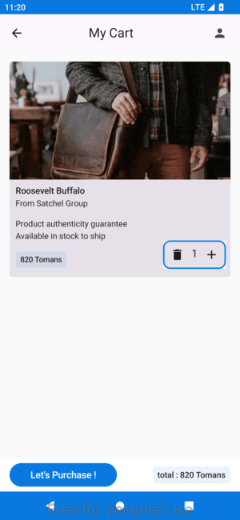
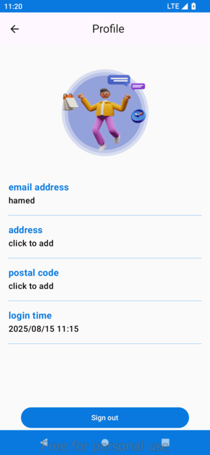

## Movie App 🎬
## 🛍️ bazzar 🛒

Discover a seamless shopping experience with ShopSavvy, a modern Android app built using Kotlin, **MVVM****, Retrofit, and **Jetpack Compose****! Browse a wide range of products 📦, add items to your cart 🛍️, and securely purchase with ease 💳. The app’s sleek, user-friendly interface 🎨, powered by Compose, ensures smooth navigation, while Retrofit handles fast and reliable API calls 🌐. With MVVM architecture, enjoy a responsive and scalable shopping journey 🚀. Shop smarter, faster, and with style! 😎✨

### 1. Features ✨

🔥 Key Features:

🔒 Real Authentication: Secure sign-up and log-in for personalized access.

💳 Purchasing: Effortless and secure checkout process.

🛍️ Add/Remove from Cart: Easily manage your shopping cart.

📋 Browse by Category: Explore products organized by categories.

### 2. Screenshots 📷

### 3. Tech Stack 🛠

* Language: Kotlin
* UI: Jetpack Compose
* Architecture: MVVM 
* Networking: Retrofit / OkHttp 
* Dependency Injection: koin 
* Coroutines & Flow for async tasks
* local : Room / shared prfs
* navigation : navigation Compose

